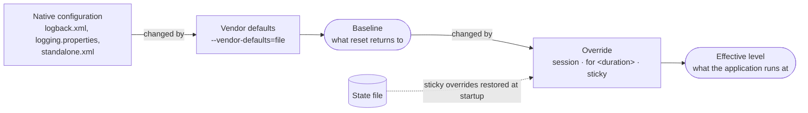

# Configuration layers

A logger's level can come from three places. Knowing which one wins, and which one `reset` goes
back to, explains most of what `logctl` does.

From the bottom up:

1. **Native configuration** is the application's own logging configuration: `logback.xml`,
   `logging.properties`, WildFly's `standalone.xml`. LogAperture reads it and never writes it.
2. **Vendor defaults** are an optional file given to the agent at startup
   (`--vendor-defaults=<file>`), usually shipped with a product. For every setting it names, it
   replaces the native value. Native configuration with the vendor defaults on top is the
   **baseline**.
3. An **override** is a change you make with `logctl set`. A logger or handler has at most one
   override at a time; a new `set` replaces it. Its tier says how long it lasts:
   `session`, `for <duration>`, or `sticky`. The baseline with the override on top is the
   **effective level**: the `EFFECTIVE` column of `logctl list loggers`.

`sticky` overrides, and `for` overrides that haven't run out, are saved in LogAperture's **state
file** and restored when the JVM starts again.

## Terms

| Term | Meaning |
|---|---|
| **Native configuration** | The application's own logging configuration. Read, never written. |
| **Vendor defaults** | The file named by `--vendor-defaults=` at agent start. |
| **Baseline** | Native configuration changed by the vendor defaults. What `reset` returns to. |
| **Override** | A change made with `logctl set`, with a tier. |
| **State file** | Where `sticky` and unexpired `for` overrides are kept between restarts. `logctl env` shows its path. |
| **Effective level** | The baseline changed by the override, if there is one. What the application runs at. |
| **Native default** | The native configuration's value alone, ignoring the vendor defaults. What `reset --to-native` returns to. |

Without a vendor defaults file, the baseline and the native default are the same thing, and you
can ignore the difference.

## What `reset` goes back to

`reset` removes the override and returns the logger or handler to its **baseline**, not
necessarily to the native configuration. If the vendor defaults set `org.perfmon4j` to `DEBUG` and
`standalone.xml` says `INFO`, then after any `set`, `reset logger org.perfmon4j` lands on `DEBUG`.

`reset … --to-native` returns it to the **native default** instead, ignoring the vendor defaults
for that logger until the JVM restarts. While it lasts, the logger follows the native
configuration: if that changes (a WildFly management change, a Logback reload), the logger moves
with it. A later plain `reset` returns it to the baseline.

Both kinds skip a `sticky` override unless you add `--include-sticky`. See [Undo changes](../how-to/undo-changes.md)
for every form of `reset`.

## Rules follow the same layers

`drop` and `trim` rules from the vendor defaults file have `vendor:` ids. `alter rule` on one of
them is an override: `reset rule` puts the vendor's definition back, and `reset rule … --to-native`
switches the rule off until the JVM restarts.

## For vendors

If you ship a vendor defaults file, you make the next version of it by tuning a running system
with `sticky` changes and exporting them with `logctl export vendor-defaults`. What each kind of
change does to the exported file, for a logger the current file sets to `DEBUG` and the native
configuration sets to `INFO`:

| Before exporting, you run | The next file says |
|---|---|
| nothing | `DEBUG`, unchanged |
| `set logger org.perfmon4j WARN sticky` | `WARN` |
| `set logger org.perfmon4j INFO sticky` | `INFO`, fixed even if the native configuration changes later |
| `reset logger org.perfmon4j --to-native` | nothing: the native configuration decides from now on |

A `session` or `for` override never reaches the exported file. See
[Vendor defaults](../vendors/vendor-defaults.md).
